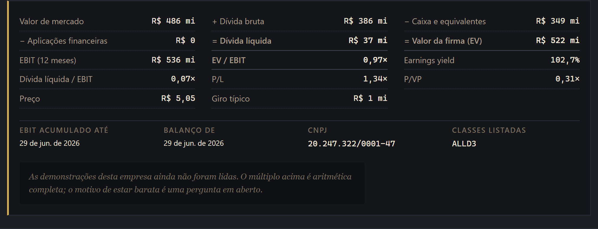
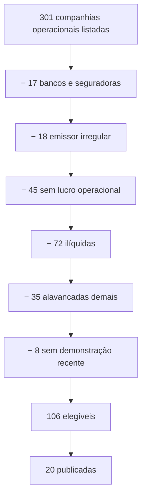
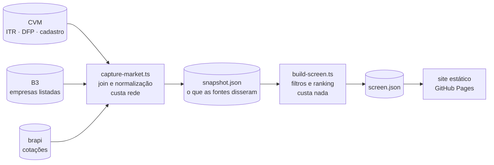

<div align="center">

<picture>
  <source media="(prefers-color-scheme: dark)" srcset="docs/img/logo-dark.png">
  
</picture>

**As vinte empresas mais baratas da B3, e a conta inteira de por que elas estão nessa lista.**

[](https://github.com/giovani-freitag/cheapside/actions/workflows/ci.yml)
[](LICENSE)
[](https://giovani-freitag.github.io/cheapside/)

### [**→ Ver a apuração**](https://giovani-freitag.github.io/cheapside/)

</div>

---

Cheapside é uma rua de Londres. Antes de ser rua era o mercado — *chepe*, em inglês antigo — e por
uns seiscentos anos foi onde a City comprava e vendia. O trocadilho em inglês veio depois e é bom
demais para recusar.

Este projeto faz uma coisa só: pega toda companhia aberta listada na B3, divide o que a empresa
inteira custa pelo que ela opera, ordena, e publica as vinte primeiras. Sem opinião, sem previsão,
sem preço-alvo. Um número, uma ordem, e tudo que entrou na conta à vista de quem quiser discordar.

<picture>
  <source media="(prefers-color-scheme: dark)" srcset="docs/img/carteira-dark.png">
  
</picture>

## Um exemplo do que isso significa

Na primeira apuração a empresa mais barata da bolsa saiu a **0,97× EV/EBIT**. A firma inteira por
menos de um ano de lucro operacional.

Os números batem com o arquivo da CVM até o último milhar de reais. E ainda assim o número é uma
ilusão: o lucro operacional daquela empresa triplicou em um ano porque *uma única linha* de despesa
operacional se moveu R$ 340 milhões, sem a receita se mexer. Isso tem formato de reversão de
provisão, não de negócio que ficou três vezes melhor.

A tela não tem como saber disso. E é exatamente por isso que ela mostra a conta em vez de só o
resultado — para que você veja o R$ 340 milhões antes de comprar a ação.



> Não é recomendação de investimento, e não é a afirmação de que barato é bom. As vinte mais baratas
> de qualquer métrica incluem empresas que estão baratas por merecerem estar.

## O que ela faz

- **Ordena por EV/EBIT** — o múltiplo do adquirente, não o P/L. Neutro à estrutura de capital.
- **Mostra a conta inteira** — cada parcela do valor da firma, a data de cada número, o CNPJ, as
  classes listadas. Nada de "confie no ranking".
- **Publica o que jogou fora** — as quase trezentas empresas excluídas, pelo motivo, com os nomes.
- **Publica os parâmetros** — todo limiar é uma escolha, e cada uma está na aba *O método*.
- **Roda sem chave de API** — três fontes públicas, nenhuma exigindo cadastro.
- **É estática** — sem servidor, sem backend, sem requisição que você precise confiar.
- **Guarda o que as fontes disseram** — um snapshot commitado, para recalcular sem rede.
- **Tema claro, escuro e do sistema**, e funciona no telefone.

## Por que EV/EBIT e não P/L

Porque P/L mede a conta de juros tanto quanto o negócio, e no Brasil a conta de juros costuma ser
maior. Porque P/VP mede o que foi pago, não o que se tem. Porque EV/EBITDA finge que depreciação não
é custo, o que favorece justamente quem mais depende dela. Porque P/FCF ordena pelo calendário de
obras.

Sobra EV/EBIT — neutro à estrutura de capital, honesto quanto à depreciação, estável o bastante para
ordenar. É a conclusão a que Greenblatt (*Magic Formula*), Gray e Carlisle (*Quantitative Value*) e
Carlisle (*The Acquirer's Multiple*) chegaram testando, cada um derrubando um pedaço do anterior.

O argumento completo, cada limiar defendido um por um, e os quatro jeitos que a métrica ainda erra:
**[docs/estrategia.md](docs/estrategia.md)**.

## O que a tela joga fora, e por quê

De cerca de 300 companhias listadas, vinte chegam à carteira. As outras saem por um motivo
declarado, e o motivo fica publicado ao lado do resultado:



| filtro | por quê |
| --- | --- |
| Bancos e seguradoras | Para eles, dívida é matéria-prima. Somá-la ao valor de mercado produz um número sem significado. E a linha que o múltiplo precisa não está lá: eles arquivam uma 3.05 como todo mundo, mas guardando um resultado apurado *depois* da conta de juros, não antes. |
| Emissor irregular | Recuperação judicial, falência, liquidação, registro suspenso, ou empresa que ainda não opera. Estão baratas porque o capital próprio pode valer zero. Incluí-las seria pôr os piores desfechos da tela no topo da própria lista. |
| Sem demonstração recente | Um múltiplo calculado sobre números de mais de oito meses atrás é um múltiplo sobre outra empresa. |
| Prejuízo operacional | Denominador negativo ordena *abaixo* de tudo que é barato de verdade. A conta não tem sentido, não é juízo de valor. |
| Iliquidez | Um preço que ninguém consegue executar é uma ficção. |
| Alavancagem | Barato porque o mercado está precificando o capital próprio como opção de sobrevivência é outro tipo de barato. |


## Como funciona por dentro

Nada roda quando você abre a página. O pipeline roda no CI, o resultado é commitado como JSON, e o
site é uma página estática em cima dele.



A separação é o ponto: `data:capture` grava **tudo que as fontes disseram** em `snapshot.json` — sem
aplicar um único filtro. Mudar um limiar, acrescentar um filtro ou publicar trinta posições vira um
segundo de aritmética em vez de outra viagem a serviços públicos que não devem nada a este projeto.

Três fontes, três chaves, nenhuma em comum: cotação chega por ticker, o registro por uma raiz de
quatro letras, e as demonstrações por CNPJ — sob qualquer *estabelecimento* que tenha arquivado. A
B3 lista a Tupy pelo terceiro estabelecimento e a CVM arquiva pelo primeiro; o join roda na raiz do
CNPJ, senão a Tupy simplesmente some do universo sem avisar.

## Instalação

Requer **Node 20.19+**.

```bash
git clone https://github.com/giovani-freitag/cheapside.git
cd cheapside
npm install
npm run dev
```

O site sobe em `localhost:5175` já com os dados commitados — não precisa rodar o pipeline para ver a
tela funcionando.

## Uso

| comando | o que faz |
| --- | --- |
| `npm run dev` | o site, sobre os dados commitados |
| `npm run data:capture` | lê as fontes e congela tudo em `snapshot.json` · **custa rede** |
| `npm run data:screen` | recalcula a tela a partir do snapshot · **offline** |
| `npm run data:build` | os dois, em ordem |
| `npm run data:verdicts` | escreve os briefings de leitura da carteira |
| `npm test` | a suíte inteira |
| `npm run build` | o bundle de produção |

Quer outra estratégia? Edite
[`screen-parameters.ts`](src/domain/rules/screen-parameters.ts) e rode `npm run data:screen` —
carteira de trinta, piso de liquidez diferente, momentum ligado. Segundos, sem tocar na rede.

`data:capture` baixa uns 150 MB de arquivos da CVM na primeira vez. Toda requisição passa por um
cache em disco com prazo por fonte — um dia para a CVM, uma semana para o registro da B3, uma hora
para cotações. `--fresh` ignora o cache no dia em que se suspeita de uma fonte.

## Arquitetura

```
src/
├── domain/          objetos de valor, entidades, regras · sem I/O, sem React, sem node:
│   ├── values/      Cnpj · FiscalPeriod · TrailingEarnings · EnterpriseValue · AcquirersMultiple
│   └── rules/       a cadeia de exclusões e os parâmetros
├── services/        uma pasta por capacidade que toca o mundo externo
│   ├── cvm/         demonstrações padronizadas · o parser mais perigoso do projeto
│   ├── b3/          registro de listadas · a ponte do ticker até o CNPJ
│   ├── quotes/      preço, giro, valor de mercado
│   ├── http/        cache em disco com prazo por fonte
│   ├── universe/    o join — e o que não consegue atravessá-lo
│   └── screen/      filtros e ranking
├── data/            schema, snapshot, serialização, e os JSON gerados
└── react/           só exibe · hooks leem serviços, componentes leem hooks
```

`src/domain` é puro. `src/services` é dono de cada I/O, e uma biblioteca externa só é importada
dentro da pasta do serviço que a embrulha. `src/react` não guarda lógica que não seja de exibição.
Um teste de arquitetura reprova quem furar isso.

## A parte que números não respondem

Voltando ao 0,97×: a tela responde *o que está barato*. Ela não responde *por quê*, e a diferença
entre uma pechincha e uma armadilha mora inteira nessa segunda pergunta.

Para isso existe uma camada opcional: uma leitura das demonstrações de cada empresa da carteira,
respondendo três perguntas e nenhuma a mais.

1. **O EBIT se repete?** Ou está inflado por venda de ativo, reversão de provisão, ganho judicial,
   pico de ciclo?
2. **O balanço é o que diz ser?** Garantias fora do balanço, partes relacionadas, covenant quebrado,
   ressalva do auditor.
3. **Há motivo estrutural para o desconto?** Conflito com o controlador, fechamento de capital,
   revisão tarifária, contrato que é a receita inteira e vence.

É feita por um modelo de linguagem, fora daqui, e volta como JSON commitado em `src/data/verdicts/`.
Aparece **ao lado** da posição, nunca dentro dela: nunca move o ranking, nunca vira nota. E empresa
que ninguém leu aparece marcada como não lida — não como aprovada, que é o erro que um espaço em
branco cometeria sozinho.

`npm run data:verdicts` gera os briefings em `docs/briefs/` com os números, os links e o formato de
resposta prontos. A leitura em si é passo separado de propósito: a tela precisa continuar
reproduzível por quem não tem conta em lugar nenhum.

## Stack

Vite 8 (Rolldown) · React 19 · Radix · TypeScript · Vitest · ESLint · release-please · GitHub Pages.
Paleta própria, temas claro, escuro e do sistema. Três vozes tipográficas, como uma página de
mercado impressa: serifa para prosa, sem serifa para os rótulos, monoespaçada para todo número.

## Contribuindo

Documentação em português; código e comentários inteiramente em inglês — inclusive as mensagens de
commit. O teste que reprova quem furar as camadas é
[`tests/arch/layering.test.ts`](tests/arch/layering.test.ts). O resto das regras está em
[CLAUDE.md](CLAUDE.md).

## Licença

MIT — ver [LICENSE](LICENSE).
